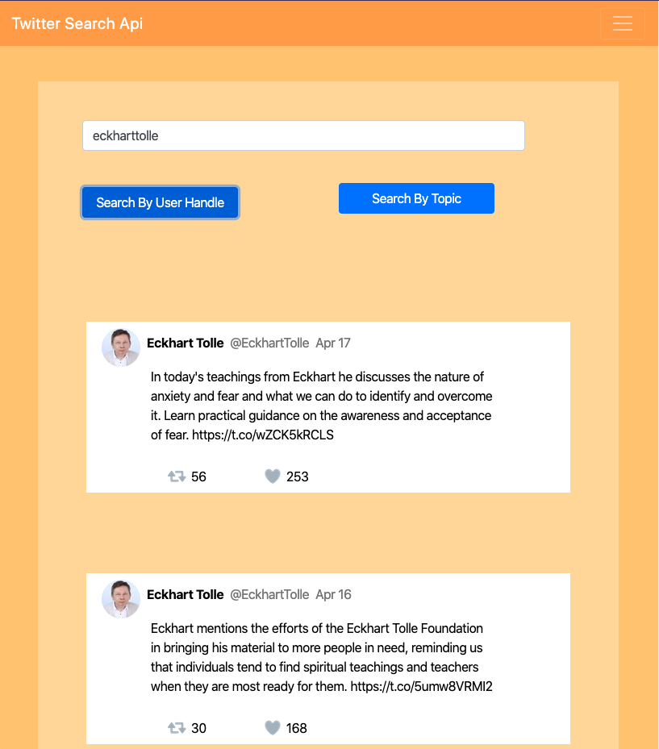

# Twitter Search Api (Bootstrap, React.js and Node.js)

App powered with React.js, Node.js and Express using an internal api and twitter's search api to get back data from twitter users and topic tweets. 

See my deployed version on Heroku - [HERE](https://floating-shore-26202.herokuapp.com/) or open-source here at my remote repostiory [Github](https://github.com/ram071985/twitter-app)



## Summary

Building this app taught me how to build an internal API and use RESTful api practices with a client-server model.  With node.js and express, I designed an internal API that sends requests from client to server-side.  The server then sends tweet data back from twitter to the app's server, and from there the server sends back the twitter data to the client side and populates it based on the client side user query.  The error handling and get requests are conducted using the Axios node.js framework for promise based HTTP requests.  I was able to configure error handling for several situations including when an input field has an incorrect value, when there is no tweet data available from the query(404), and when the server is not responding(500).  I thoroughly enjoyed learning how to use node.js and express and diving deeper into the world of API's.

On the front-end of this app I used the JavaScript framework React.js with client-side routing.  For styling, I used bootstrap and CSS with media queries for responsive design and UI.  There are 3 sections to the app; the splash or landing page, search page and favorite twitter users page.  On the search section of the web app you can choose between querying twitter user's handle or a random topic which dynamically renders 10 tweet cards with the data displayed in twitter-like fashion.  On the random page the user can choose from one of my 5 favorite twitter users and the page will display 1 random tweet displayed in a card from that user.  I became acquainted with the Moment library to help with reconstructing tweet date data coming back from the standard twitter search API.

## Installation Instructions

1.) Run `npm i` in the terminal (in the root directory)
2.) Run `npm --prefix client` in the terminal (in the root directory)
3.) Create a file called `.env`. Use the `dev.env` file as a template. 
4.) Run the script `npm run dev` to fire up the server
5.) Open a browser and navigate to `localhost:3000`


Then to run the app on your system use the command:

```
npm run start
```


## Author 

* **Reid Muchow** - *Front-End Software Developer* - [Website](https://www.reidmuchow.com) | [LinkedIn](https://www.linkedin.com/in/reidmuchow/)
